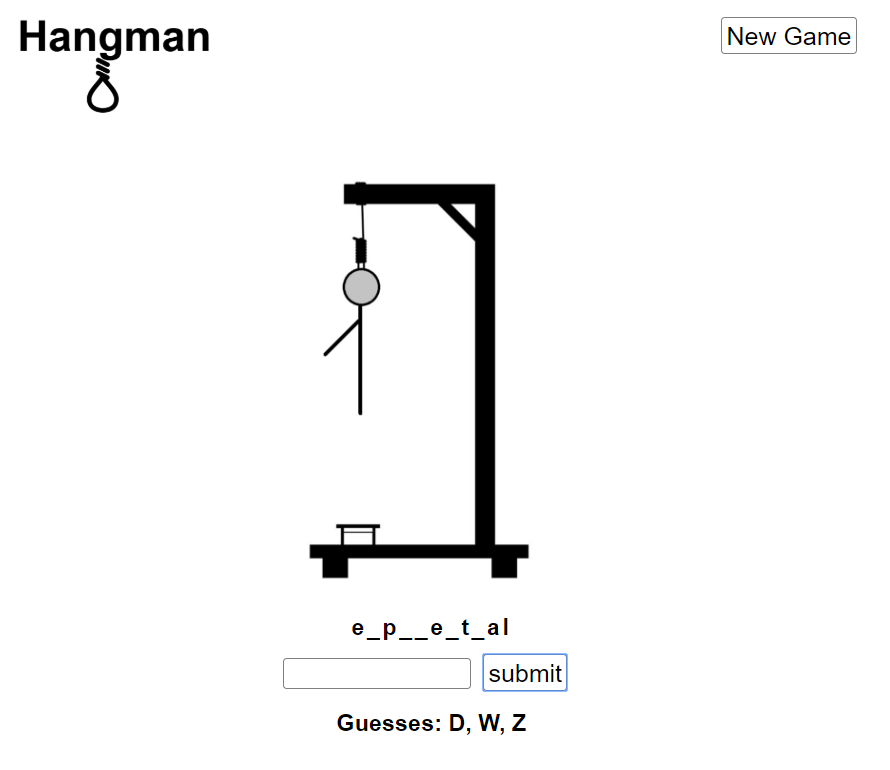

# Hangman

[Hangman]() While experimenting with python I created this modern take on a classic game.  
## Backend:
To try it out yourself clone the backend https://github.com/LeoVeres/hangman-backend 
and 'python app.py' then clone this repo and 'npm start'.

## Screenshots

## Tech Used

### Front-End
* React
* Redux
* HTML
* CSS

### Back-End
* Python

### Deployment
* Heroku
* mLab